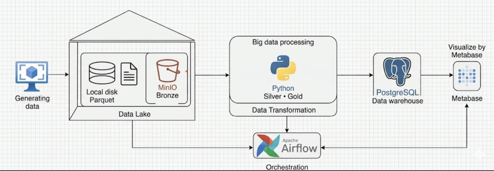
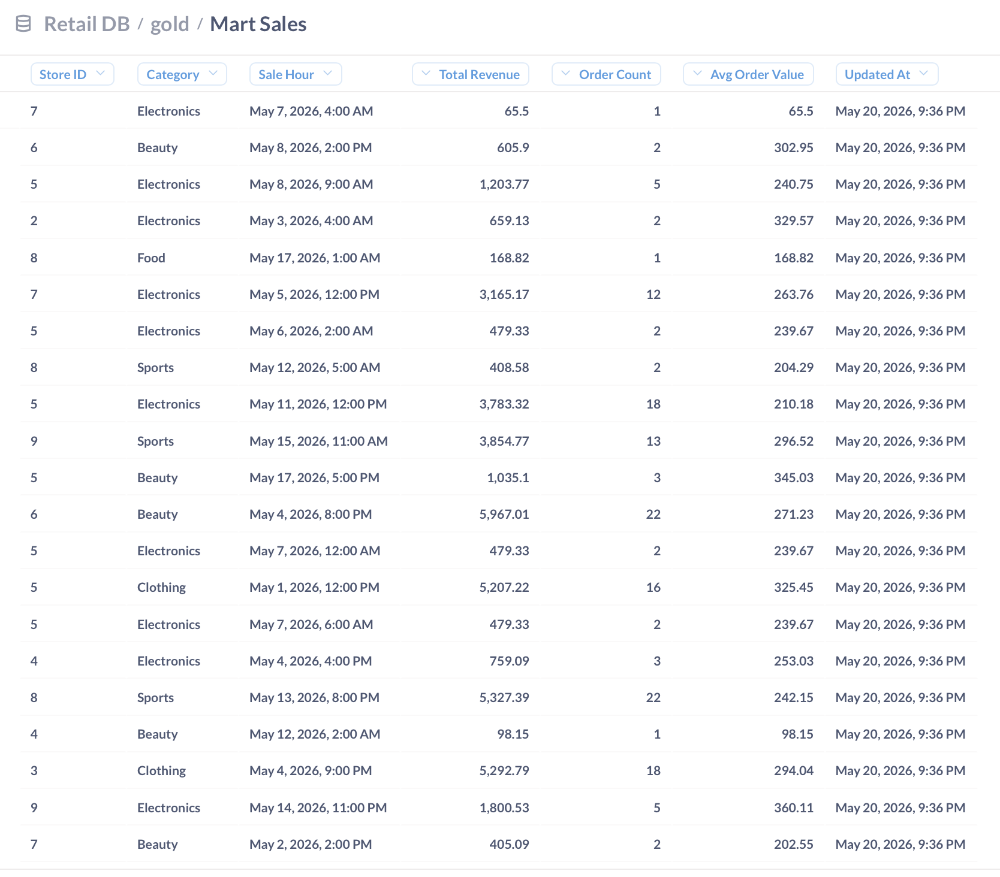
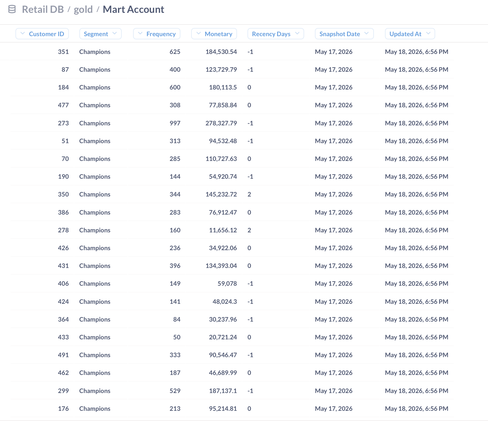
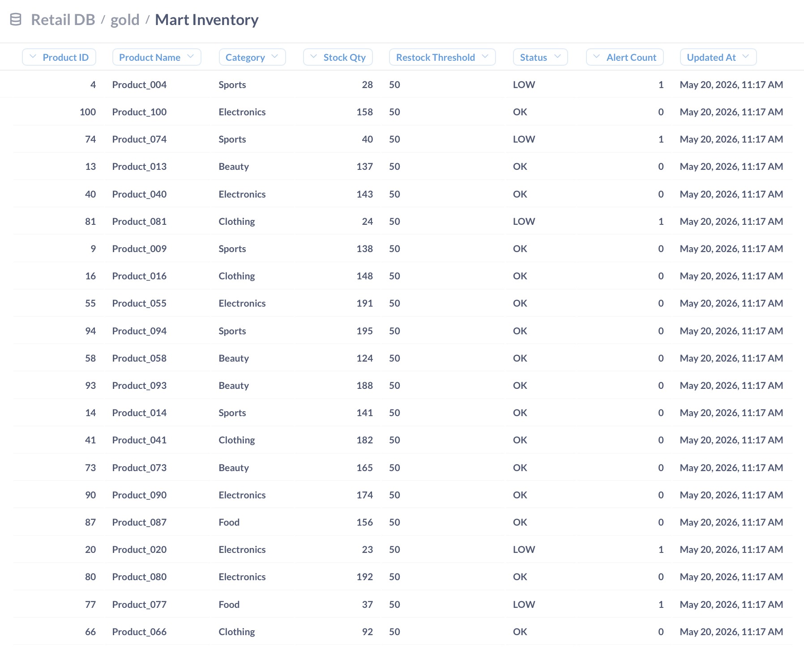
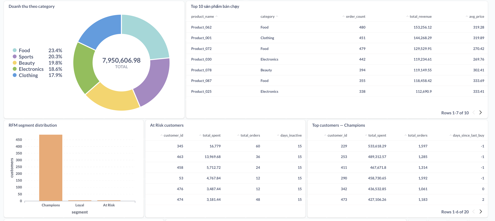

# Retail Data Lakehouse Pipeline

A near real-time retail analytics platform built on a Medallion Architecture, featuring automated data ingestion, transformation, inventory tracking, RFM customer segmentation, and ML-powered product recommendations.

---

## Introduction

As data needs grow and businesses increasingly require gradual migration to modern data platforms, retail operations demand a system built around three core pillars: **sales performance**, **inventory management**, and **customer insight**.

This project addresses the challenge of observing and consolidating near real-time sales data, maintaining live inventory status in order to decice whether to import goods according to the customer demands, and computing incremental RFM (Recency, Frequency, Monetary) analysis to build up a better customer experience — all within a unified, automated pipeline.

The system is designed so that raw data is always preserved on local disk (mirroring what would come from operational systems), giving engineers and analysts a reliable source to audit, replay, or debug when issues arise downstream between the original data and data in data lake. 

---
## Architecture


---
## Objectives

### Medallion Architecture

The pipeline is structured into four layers:

```
Raw (Disk) → Bronze (MinIO) → Silver (PostgreSQL) → Gold (PostgreSQL)
```

| Layer | Storage | Purpose |
|-------|---------|---------|
| **Raw** | Local disk (Parquet) | Immutable source-of-truth; mirrors operational output for auditability and replay |
| **Bronze** | MinIO (S3-compatible) | Durable backup and staging; decouples ingestion from transformation |
| **Silver** | PostgreSQL (`silver` schema) | Cleaned, quality-checked, and enriched data ready for analytics |
| **Gold** | PostgreSQL (`gold` schema) | Purpose-built marts for each business function or team |

### Why this design?

- **Raw on disk**: Preserves the original data as produced, enabling full replay and independent auditing without touching upstream systems.
- **Bronze on MinIO**: Acts as a cost-effective backup layer and a buffer between ingestion and transformation, so failures in downstream processing never affect the source.
- **Silver in PostgreSQL**: Centralises data quality checks, deduplication, and enrichment (e.g. joining product metadata) before data reaches consumers.
- **Gold marts**: Each mart is tailored to a specific business domain — sales performance, customer segmentation, and inventory — so downstream teams query pre-aggregated, reliable data without hitting raw tables.

### Gold Mart Design Rationale

| Mart | Schema | Why it exists |
|------|--------|---------------|
| `mart_sales` | `store_id`, `category`, `sale_hour`, `total_revenue`,`order_count`, `avg_order_value` | Hourly revenue aggregation per store and category; powers sales dashboards and trend analysis |
| `mart_account` | `customer_id`, `segment`, `frequency`, `monetary`, `recency_days`, `snapshot_date` | Daily RFM snapshots with historical tracking; supports retention campaigns and customer lifecycle analysis |
| `mart_inventory` | `product_id`, `stock_qty`, `status`, `alert_count` | Live inventory status with restock alerts; used by operations teams for procurement decisions |

## Mart_sale

## Mart_account

## Mart_inventory



All gold tables use `ON CONFLICT DO UPDATE` (upsert), making every refresh idempotent regardless of retries.

### Data Quality Handling

The silver layer applies the following checks before writing:
- Drop rows with nulls in critical columns (`sale_id`, `customer_id`, `product_id`, `amount`)
- Deduplicate within each batch on `sale_id`
- Filter out non-positive `amount` values

---

## Technology Stack


**Apache Airflow 2.7** 
**MinIO** 
**PostgreSQL 16**
**Python** 
**boto3** 
**Metabase** 
**Grafana**
**Docker Compose**

---

## Machine Learning

Two ML models run daily on `silver.sales_enriched` and write results to Gold:

### FP-Growth — Product Affinity
Builds a customer-level basket matrix and mines association rules to identify products frequently purchased together. Results (antecedent → consequent, support, confidence, lift) are stored in `gold.mart_product_affinity` and used to inform restocking priorities and bundling decisions.

### Collaborative Filtering (SVD)
Constructs a user-item spending matrix and applies Singular Value Decomposition to learn latent customer-product preferences. For each customer, the top-5 unvisited products with the highest predicted scores are written to `gold.mart_cf_recommendations`, supporting personalised upsell campaigns.

Both models auto-adjust parameters based on data volume (e.g. `min_support` scales with number of customers) and are triggered automatically at the end of each daily Gold refresh.

---

## Scale & Resource Usage

| Dimension | Value |
|-----------|-------|
| Schedule | Hourly ingestion, daily RFM + Gold + ML |
| `max_active_runs` | 2 (ingestion DAG), 2 (bronze-to-silver DAG) |
| `max_active_tasks` | 2 per DAG |
| Records per hour | ~50 (off-peak) → ~900 (peak hours: 11–13h, 19–21h) |
| Max records per day | ~9,750 rows (sum across all 24 hourly partitions) |
| Airflow memory limit | Scheduler: 2 GB, Webserver: 1 GB |
| Storage layers | Raw (local disk) + Bronze (MinIO volume) + Silver/Gold (PostgreSQL volume) |
| Retries | Up to 99 retries per task with exponential backoff (max 30 min delay) |

The pipeline is designed to handle backfill (`catchup=True`) across multiple days within `max_active_runs` constraints, processing up to 48 hourly partitions concurrently in a two-run window.

---

## Results & Dashboards

Dashboards are served via **Metabase** connected directly to the Gold layer:

### Sales Overview
- Revenue by store (last 7 days)
- Sales trend over time (last 30 days)
- Top 10 best-selling products
- Revenue breakdown by category

### Customer Insights (RFM)
- Segment distribution (Champions, Loyal, At Risk, Lost)
- Top spending customers per segment
- Monetary vs. Frequency scatter analysis

### Inventory Management
- Full inventory status table (CRITICAL / LOW / OK)
- Product count by inventory status


.png)

---

## 🗂️ Project Structure

```
.
├── dags/
│   ├── retail_ingestion.py        # Hourly ingestion DAG
│   ├── bronze_to_silver.py        # Bronze → Silver transformation DAG
│   ├── daily_rfm.py               # Daily RFM snapshot DAG
│   ├── daily_inventory_report.py  # Daily inventory alert report DAG
│   ├── silver_to_gold.py          # Silver → Gold mart refresh DAG
│   └── dag_ml_affinity.py         # Daily ML product affinity DAG
├── sale_pipeline/
│   ├── gen_data.py                # Hourly sales data generator
│   ├── lake_writer.py             # Raw layer Parquet writer
│   ├── bronze_ingest.py           # Disk → MinIO uploader
│   ├── silver_transform.py        # MinIO → PostgreSQL transformer
│   ├── gold_marts.py              # Silver → Gold mart upserts
│   ├── rfm_writer.py              # Incremental RFM snapshot writer
│   ├── inventory_manager.py       # Inventory deduction and alerting
│   ├── product_affinity.py        # FP-Growth + SVD ML pipeline
│   └── seed_db.py                 # Product and inventory seeder
├── sql/
│   ├── init_schemas.sql           # Schema initialisation
│   └── ml_gold_tables.sql         # ML output table definitions
├── grafana/                       # Grafana provisioning configs
├── metabase/                      # Metabase config and provisioning
├── docker-compose.yml             # Main compose file
├── docker-compose-2.yml           # Alternative compose (updated config)
├── metabase_setup.py              # Automated Metabase dashboard setup
└── rebuild_silver.py              # One-time silver recovery script
```

---

## 🚀 Getting Started

### Prerequisites
- Docker & Docker Compose
- ~4 GB RAM available

### Setup

```bash
# 1. Clone the repository
git clone https://github.com/<your-username>/retail-lakehouse-pipeline.git
cd retail-lakehouse-pipeline

# 2. Create a .env file
cp .env.example .env
# Edit .env with your preferred credentials

# 3. Start all services
docker compose up -d

# 4. Wait ~2 minutes for services to initialise, then seed the database
docker exec airflow_scheduler python /opt/airflow/sale_pipeline/seed_db.py

# 5. (Optional) Auto-configure Metabase dashboards
python metabase_setup.py

# 6. Enable the DAGs in Airflow UI
# http://localhost:8081
# Enable: hourly_retail_ingestion_v4
```

### Service URLs

| Service | URL | Default Credentials |
|---------|-----|-------------------|
| Airflow | http://localhost:8081 | See `.env` |
| MinIO Console | http://localhost:9001 | `minioadmin / minioadmin` |
| Metabase | http://localhost:3001 | `admin@retail.com / admin1234` |
| Grafana | http://localhost:3000 | See `.env` |

---
